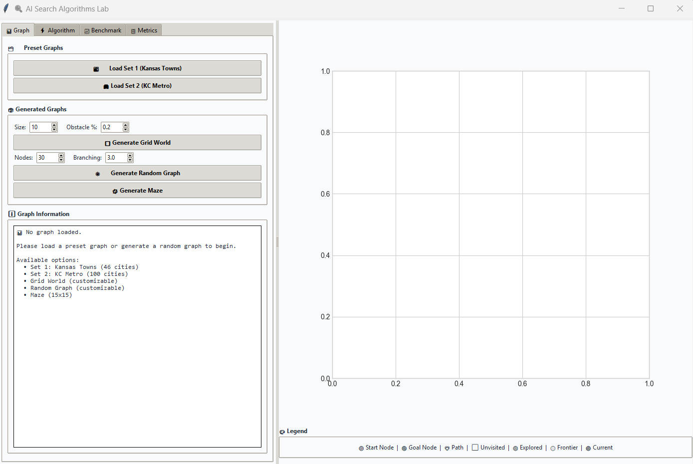
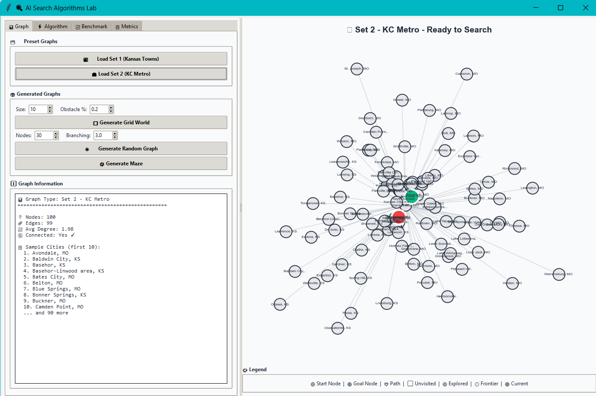
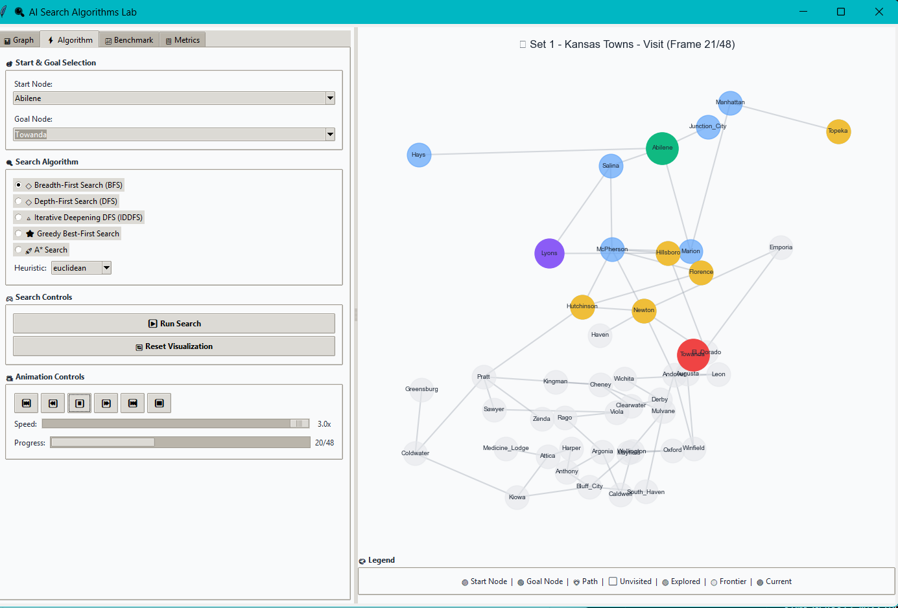
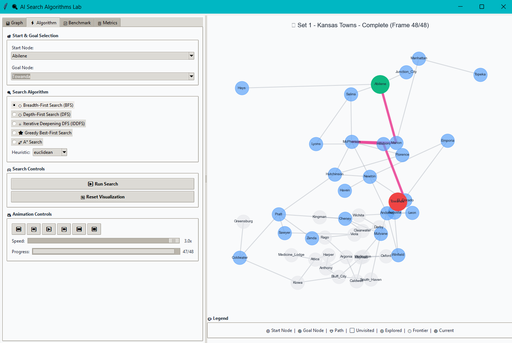
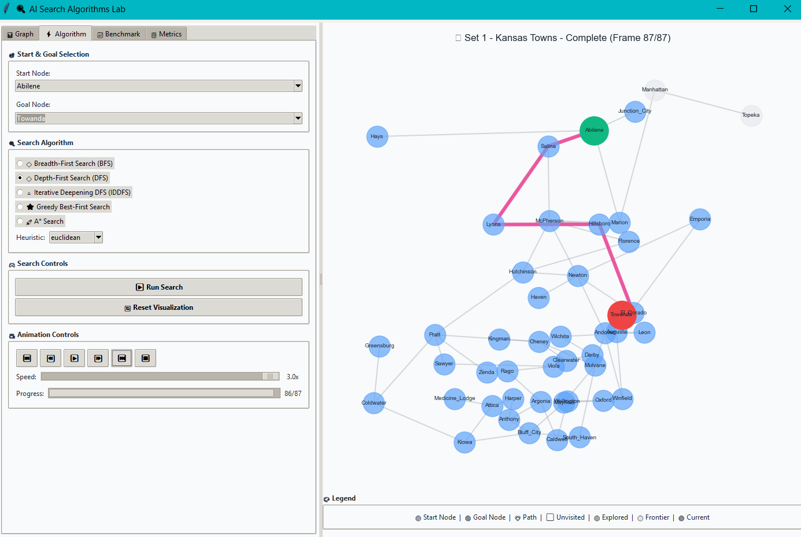
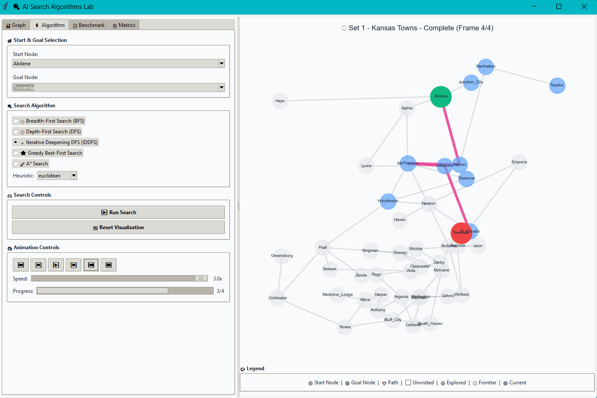
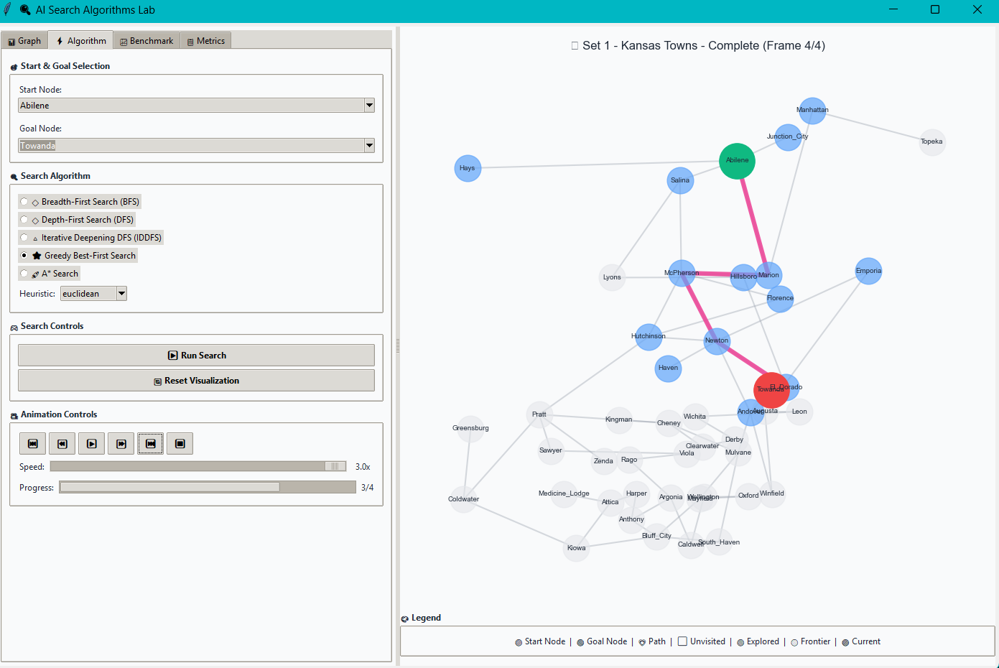
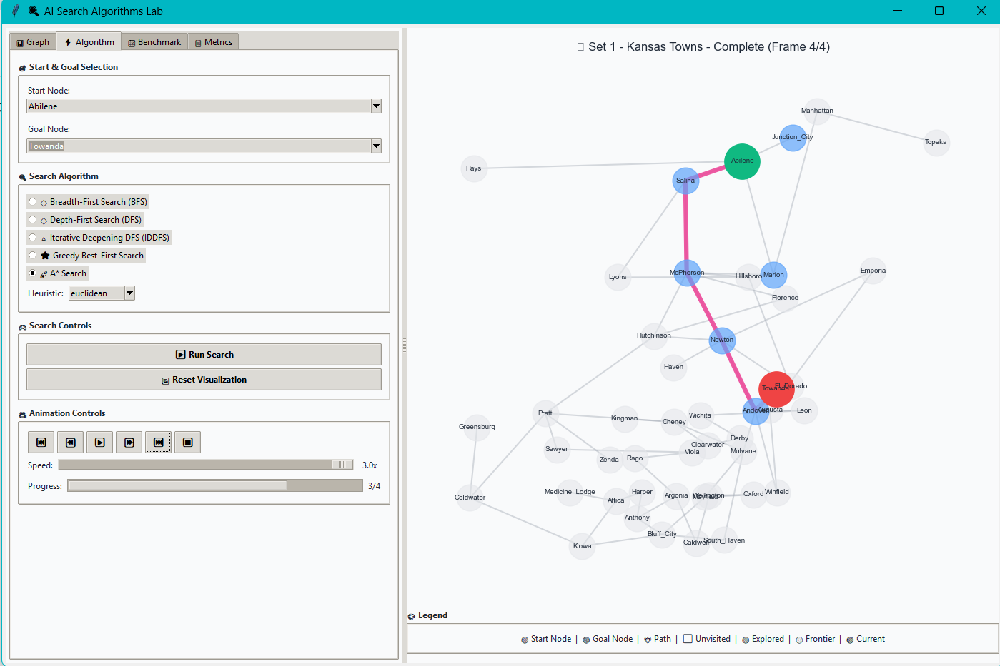
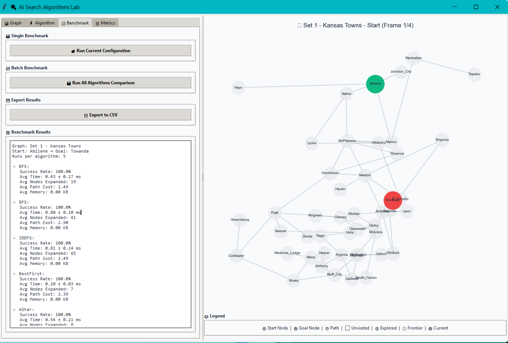

# README.md
# AI Search Algorithms 

A comprehensive implementation of search algorithms with visualization and benchmarking capabilities.

## Features

- **5 Search Algorithms**: BFS, DFS, Iterative Deepening DFS, Best-First Search, A*
- **Multiple Graph Types**: Kansas towns, KC Metro, random graphs, grid worlds
- **Interactive Visualization**: Real-time search animation with color coding
- **Benchmarking**: Performance metrics and comparison across algorithms
- **GUI Interface**: User-friendly Tkinter-based interface

## Installation

1. Clone the repository
2. Install dependencies:
   ```bash
   pip install -r requirements.txt```

## Screentshots 








